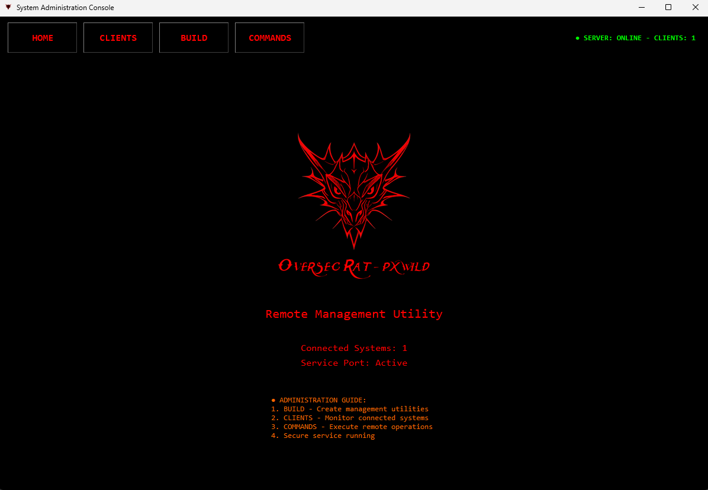
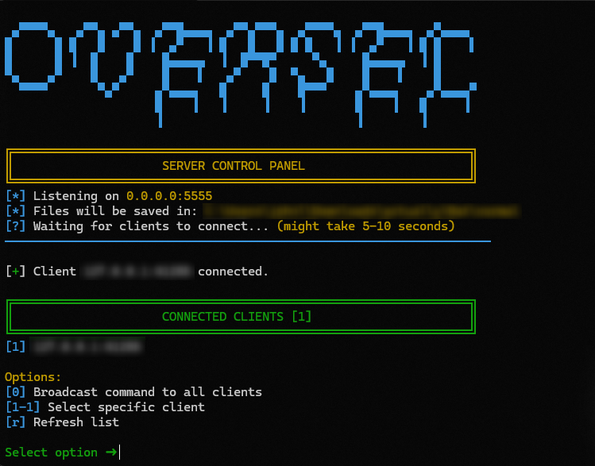

# System Administration Console

**pxwild.com** - For support or questions, contact me at [pxwild.com](https://pxwild.com).

> **WARNING:** This tool is intended for advanced users with a strong understanding of networking and security. Unauthorized use is illegal. Ensure you have permission before proceeding. Learn the basics first if you're new to this.

## Overview

This is a **System Administration Console** designed for remote system management and monitoring, built with Python. It includes both a GUI (`all.py`) and terminal-based (`server.py`, `client.py`) versions for flexibility. The terminal version is recommended for production use due to its reliability and control.

## Client Setup - READ THIS FIRST

To hide your public IP address, do not rely solely on obfuscation. Converting the client script to an executable (EXE) is highly recommended to protect sensitive information like your server's IP. The terminal version (`server.py` and `client.py`) is preferred for real-world applications due to its stability.

**_Note: I will update this script with improvements when I have time._**

### App Version (GUI)


- Suitable for users preferring a graphical interface.
- Features a user-friendly dashboard for managing connected systems.
- **Note**: Not all features are fully functional in the GUI version. For example, the EXE builder and code obfuscation features may not work reliably. Use the terminal version for these tasks.

### Terminal Version (Recommended)


- Offers greater control and reliability.
- Ideal for advanced users comfortable with command-line interfaces.
- Fully supports all features, including EXE building and obfuscation.

## Features

- **Multi-Client Support**: Manage multiple systems simultaneously.
- **Remote Command Execution**: Run commands on connected clients.
- **File Transfer**: Upload and download files to/from clients.
- **System Monitoring**: Capture screenshots, webcam images, audio, and keylogs.
- **Network Insights**: Retrieve WiFi passwords, browser history, and network connections.
- **Persistence**: Automatic reconnection and startup integration.
- **Security Features**: Built-in obfuscation and evasion techniques for educational purposes.

## Quick Start

### Prerequisites

Ensure Python 3.8+ is installed. Install required dependencies for the chosen method.

### Method 1: GUI Version (`all.py`)

1. **Install Dependencies**:
   ```bash
   pip install tkinter pillow requests pyinstaller psutil pynput pywin32 opencv-python
   ```

2. **Run the GUI**:
   ```bash
   python all.py
   ```

3. **Configure**:
   - The GUI automatically starts a server on an available port (e.g., 8080, 8443).
   - Use the interface to monitor systems and send commands.
   - **Warning**: Avoid using the EXE builder or obfuscation features in the GUI, as they are unreliable. Use the terminal version instead.

### Method 2: Terminal Version (Recommended)

1. **Install Dependencies**:
   ```bash
   pip install requests psutil pynput pywin32 opencv-python
   ```

2. **Start the Server**:
   ```bash
   python server.py
   ```
   - The server will display the IP and port (default: `0.0.0.0:5555`).
   - Files (screenshots, webcam images, etc.) are saved in the server's directory.

3. **Edit Client Script**:
   - Open `client.py` and update the server details:
     ```python
     SERVER_IP = "YOUR_SERVER_IP_HERE"  # Replace with your server's IP
     SERVER_PORT = 5555 
     ```
   - For local testing, use `127.0.0.1` as the IP.

4. **Run Client on Target System**:
   ```bash
   python client.py
   ```
   - **Important**: Only run `client.py` on systems you own or have explicit permission to test.
   - The client runs hidden and attempts to persist on the system.

5. **Send Commands**:
   - From the server terminal, select a client and enter commands (see below for available commands).

## Available Commands

### Basic System Commands
- `getip`: Retrieve the client's public IP address.
- `sysinfo`: Display detailed system information (OS, processor, etc.).
- `pwd`: Show the current working directory.
- `tasklist`: List running processes.
- `processes`: Detailed process list with IDs.
- `systeminfo`: Comprehensive system information.
- `netstat`: Display active network connections.

### File System Commands
- `dir` or `ls`: List files in the current directory.
- `cd [folder]`: Change to the specified directory.
- `find [filename]`: Search for files by name.
- `download [file]`: Download a file from the client.
- `del [file]`: Delete a file on the client.

### Monitoring Commands
- `screenshot`: Capture and save a screenshot.
- `webcam`: Capture a webcam image.
- `mic_record`: Record 10 seconds of audio.
- `keylogger_start`: Start a keylogger (logs saved in temp folder).
- `clipboard`: Retrieve clipboard contents.

### Network Commands
- `wifipasswords`: Extract saved WiFi passwords.
- `browserhistory`: Retrieve browsing history from Chrome, Edge, etc.

### System Control Commands
- `kill [process]`: Terminate a specified process.
- `message [text]`: Display a message box on the client.
- `disable_taskmgr`: Disable Task Manager.
- `enable_taskmgr`: Enable Task Manager.
- `shutdown`: Schedule system shutdown (30s delay).
- `restart`: Schedule system restart (30s delay).
- `cancel_shutdown`: Cancel scheduled shutdown/restart.

### Advanced Commands
- `startup`: List programs in the startup folder.
- `all`: Extract browser profiles and account information.
- `beep [duration]`: Play a system beep for the specified duration (ms).
- `av_evasion_demo`: Demonstrate antivirus evasion techniques (educational).
- `behavior_evasion`: Simulate benign behavior to avoid detection (educational).

## Building Executables

To hide your public IP and protect the client script, convert `client.py` to an executable using the terminal version:

1. **Install PyInstaller**:
   ```bash
   pip install pyinstaller
   ```

2. **Build the Executable**:
   ```bash
   pyinstaller --onefile --noconsole --icon=logo.ico client.py
   ```
   - Replace `logo.ico` with your desired icon file.
   - The executable is created in the `dist` folder.
   - **Note**: Do not use the GUI version's EXE builder, as it is unreliable.

3. **Distribute**:
   - Share the executable with systems you own or have permission to manage.
   - Ensure the `SERVER_IP` and `SERVER_PORT` are set correctly before building.

## Security and Persistence

- **Client Hiding**: The client runs hidden using `pythonw` and sets its process title to `svchost.exe`.
- **Persistence**:
  - Copies itself to the Windows Startup folder (`WindowsDefenderUpdate.py`).
  - Adds registry entries for auto-start.
  - Creates backup copies in temporary directories.
- **Reconnection**: Automatically reconnects to the server with exponential backoff (up to 1000 attempts).
- **Obfuscation**: Use external tools (e.g., PyArmor) to obfuscate the client script, or convert to an EXE to hide your IP. Avoid using the GUI's obfuscation feature, as it is unreliable.

## Important Notes

- **Server (`server.py`)**: Run on your control machine to manage clients.
- **Client (`client.py`)**: Deploy only on systems you own or have permission to test.
- **GUI (`all.py`)**: Combines server and client management with a graphical interface, but some features (EXE builder, obfuscation) are unreliable.
- **Testing**: Use `127.0.0.1` for local testing to avoid unintended network activity.
- **Logs**: Files (screenshots, audio, etc.) are saved in the server's working directory.
- **Dependencies**: Some commands (e.g., `screenshot`, `webcam`) require additional libraries (`pillow`, `opencv-python`).
- **Support**: Need help? Contact me at [pxwild.com](https://pxwild.com).

## Security Considerations

- **IP Protection**: Always compile `client.py` to an EXE or use external obfuscation tools to hide your public IP address.
- **Permissions**: Only deploy on authorized systems. Unauthorized access is illegal.
- **Firewall**: Ensure your server port is open and not blocked by firewalls.
- **Antivirus**: Some commands (`av_evasion_demo`, `behavior_evasion`) are for educational purposes and may trigger antivirus software.

## Troubleshooting

- **Connection Issues**:
  - Verify the server IP and port in `client.py`.
  - Check firewall settings on both server and client.
  - Use `netstat` to confirm the server is listening.
- **Missing Dependencies**:
  - Install required libraries using `pip`.
  - For GUI, ensure `tkinter` is available (included with Python).
- **Command Failures**:
  - Some commands require administrative privileges.
  - Ensure required libraries are installed for specific commands (e.g., `pynput` for keylogging).
- **GUI Issues**:
  - If the EXE builder or obfuscation fails, switch to the terminal version and use PyInstaller or external obfuscation tools.

## Disclaimer

This tool is for **educational and research purposes only**. The developers are not responsible for any misuse. Unauthorized access to systems is illegal and unethical. Use only on systems you own or have explicit permission to test.

**Ethical Use**: With great power comes great responsibility. Use this tool responsibly and legally.
